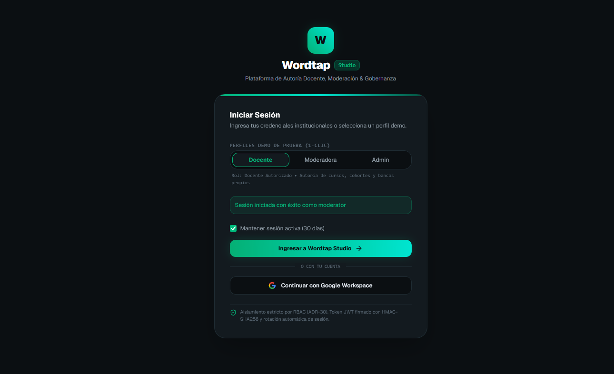
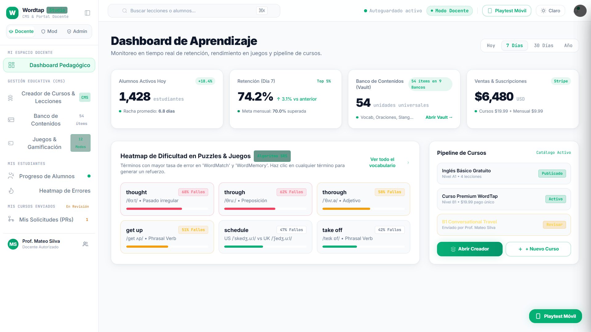
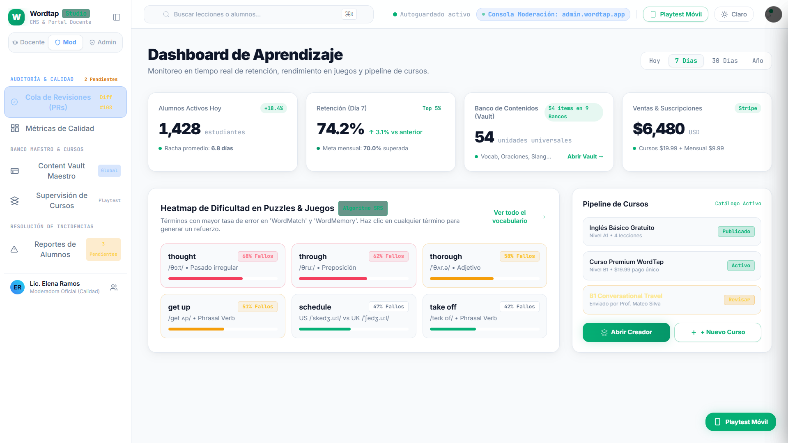
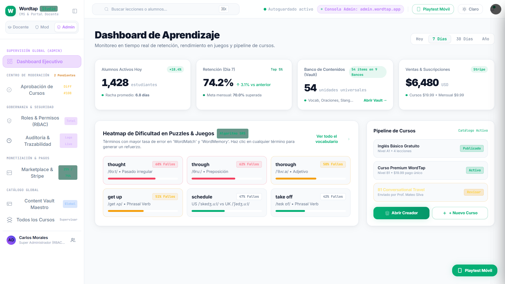

# Wordtap Studio

Portal de Gestión Académica, Autoría Docente y Gobernanza para el ecosistema Wordtap.

<p align="center">
  
</p>

## Vistas del Sistema (Roles Demo)

### 1. Panel de Docente
Autoría de cursos y lecciones, seguimiento de cohortes y diagnóstico de errores de alumnos.

<p align="center">
  
</p>

### 2. Consola de Moderación
Cola de revisión de solicitudes (PRs), aprobación pedagógica y control de calidad de contenidos.

<p align="center">
  
</p>

### 3. Dashboard Super Administrador
Supervisión global ejecutiva, analíticas de actividad, métricas y gobernanza de roles (RBAC).

<p align="center">
  
</p>

---

## Stack Tecnológico

- **Framework**: [Next.js](https://nextjs.org/) (App Router, Turbopack)
- **Lenguaje**: TypeScript
- **Estilos**: Tailwind CSS v4 (Design tokens OpenDesign)
- **Gestor de paquetes**: [pnpm](https://pnpm.io/)
- **Iconografía**: [Lucide React](https://lucide.dev/)

## Arquitectura

El proyecto implementa una arquitectura modular orientada al dominio (**Feature-Driven Architecture**):

```text
src/
├── app/               # Ruteo y layouts
│   ├── (auth)/        # Rutas de autenticación
│   ├── layout.tsx     # Root layout
│   └── page.tsx       # Redirect raíz
├── features/          # Módulos aislados por dominio de negocio
│   └── auth/          # Login, roles y perfiles demo
├── components/        # Componentes UI transversales
└── lib/               # Utilidades globales (cn, etc.)
```

## Desarrollo Local

Instalar dependencias:

```bash
pnpm install
```

Iniciar servidor de desarrollo:

```bash
pnpm dev
```

Abrir [http://localhost:3000](http://localhost:3000) en el navegador.

## Compilación

```bash
pnpm build
```
